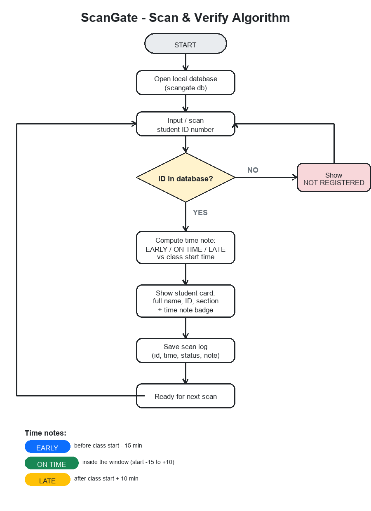

# Project Proposal

## Title

**ScanGate: A Student ID Scanning and Verification System with
Automated Time Notes for the College of St. Catherine of Quezon City**

Proponents: Group 6 (BT-204)
Course: Object-Oriented Programming
Date: September 2026

---

## 1. Introduction

At school events and gate checks, staff still verify students by looking
at the physical ID and writing names in a logbook. It is slow when a
line forms, the handwriting is hard to read later, and nobody can tell
at a glance who was late without flipping pages. We want a small system
where the guard or instructor types or scans the student number and
right away sees if the ID is valid and whether the student is early,
on time, or late.

ScanGate does this. It reads the student number, checks it against the
student list stored in a local database, and shows the student's full
name, ID number, and section on the spot. Every scan gets a time note
(EARLY, ON TIME, or LATE) based on the class start time, and the scan is
saved with the date and time. The whole thing runs offline on one
laptop. No internet needed at any point.

## 2. Statement of the Problem

- Manual ID checking is slow during peak hours.
- Paper logbooks are hard to search and easy to lose.
- There is no quick way to tell who was late without reading the whole
  logbook by hand.
- The school portal needs a server and internet, which the gate or the
  event venue may not have.

## 3. Objectives

General: build an offline ID scanning and verification system that shows
OOP in Python.

Specific:

1. Store the student list in a local SQLite database.
2. Verify a student number in one step and show the result clearly
   (green for registered, red for not registered), with the full name,
   ID number, and section.
3. Mark every scan EARLY, ON TIME, or LATE against a class start time
   that admins can change.
4. Log every scan with date, time, note, and status.
5. Import the student list from a CSV file, even when the column names
   are not exact (example: "Student No", "ID", or "LRN").
6. Split the system by role: students only get the verification page,
   while import, records, and settings sit behind an admin login.
7. Keep the look consistent with the school portal so it feels familiar.

## 4. Scope and Limitations

In scope: single laptop, local database, CSV import, scan log with time
notes, admin accounts, portal-style web page that runs on localhost.

Out of scope: barcode hardware drivers (any USB scanner works since it
types like a keyboard), face recognition, SMS or email notices (dropped,
the project brief is offline), online sync, multi-user accounts beyond
the admin role.

## 5. Algorithm

### 5.1 Main scan loop

```
1. Start the program and open the database (scangate.db).
2. Wait for input in the scan box.
3. Read the student number.
4. Look it up in the students table.
5. If there is no match:
     show "NOT REGISTERED" in red, then go back to step 2.
6. If there is a match:
     a. compute the time note:
          EARLY    if now <  class start - 15 min
          ON TIME  if now is inside [start - 15 min, start + 10 min]
          LATE     if now >  class start + 10 min
     b. show the student card (full name, ID number, section, status).
7. Save one row in scan_logs (student number, timestamp, note, status).
8. Go back to step 2 for the next student.
```

### 5.2 CSV import

```
1. Open the chosen CSV file.
2. Read the header row. Match each column to a field using the alias
   list (example: "Student No", "ID", and "LRN" all map to student_id).
3. If student_id or full_name has no matching column, stop and say
   which one is missing.
4. For each row: skip blank lines, build a Student, and validate it
   (blank names and gmails without "@" are rejected with the row number).
5. If the student number already exists, update that record.
   Otherwise insert a new one.
6. Report how many were added and how many were updated.
```

### 5.3 Flowchart

```
            +------------------+
            |      START       |
            +--------+---------+
                     v
            +------------------+
            |  open database   |
            +--------+---------+
                     v
            +------------------+<------------------+
            |  input / scan ID |                   |
            +--------+---------+                   |
                     v                             |
               +-----------+     NO     +-----------------------+
               | ID found? |----------->| show NOT REGISTERED   |
               +-----+-----+            +----------+------------+
                     | YES                         |
                     v                             |
            +------------------------+             |
            | compute EARLY/ON TIME/ |             |
            | LATE from class start  |             |
            +-----------+------------+             |
                        v                          |
            +------------------------+             |
            | show student card with |             |
            | name, ID, section, note|             |
            +-----------+------------+             |
                        v                          |
            +------------------------+             |
            | save scan log          |             |
            +-----------+------------+             |
                        v                          |
            +-----------------------------+        |
            |  ready for next student     |--------+
            +-----------------------------+
```

### 5.4 Rules that close the loopholes

Every input hits exactly one path, and every path is decided:

| Case | What happens |
|---|---|
| Blank or whitespace input | Rejected before any lookup (400) |
| Unknown ID | Red NOT REGISTERED card, nothing is logged |
| Registered ID | Green card + scan log written, one atomic step |
| Same student scans twice | Both scans logged on purpose, the admin sees the real history |
| CSV re-imported | Existing numbers get updated, never duplicated |
| CSV row with no student number | Falls back to the access key; if both are blank the row is skipped |
| Any admin URL without login | 302 to /login (pages) or 401 (API) |
| Setup page after first account exists | Permanently closed, redirects to /login |
| Password storage | PBKDF2 hash with random salt, never plaintext |
| No internet | Nothing in the scan path touches the network |



## 6. OOP design

| Concept | Where we used it |
|---|---|
| Encapsulation | `Database` hides every SQL statement; `UserStore` hides password hashing |
| Inheritance | deliberately shallow: dataclasses (`Student`, `ScanRecord`) carry defaults and self-validation, and the design favors composition over deep class trees, which the code is cleaner for |
| Polymorphism | the same `IDCheckSystem.scan()` drives the web page, the terminal scanner, and the exe without changes |
| Abstraction | the web routes never touch SQL, they only know the facade's methods |
| Composition | `IDCheckSystem` is composed of a `Database`; the Flask app is composed of the system plus a `UserStore` |
| Facade | `IDCheckSystem` is the single entry point for the web app and the terminal version |

## 7. Tools

- Python 3.11, Flask for the local page, SQLite for storage
- HTML/CSS/JS hand-written to match the school portal look
- PBKDF2 (hashlib) for admin passwords
- PyInstaller for the exe, unittest for testing

## 8. Expected output

1. A portal-style page at 127.0.0.1 where scanning an ID instantly shows
   verified or not registered, with the student's full name, ID number,
   section, and an EARLY / ON TIME / LATE note.
2. An admin dashboard with CSV import, the student list, recent scans,
   and late/on-time counts for the day.
3. A recent scans table that updates after every scan.
4. Admin accounts (first one created on setup, more added anytime).
5. A portable exe that runs on any Windows laptop without installing
   anything.
